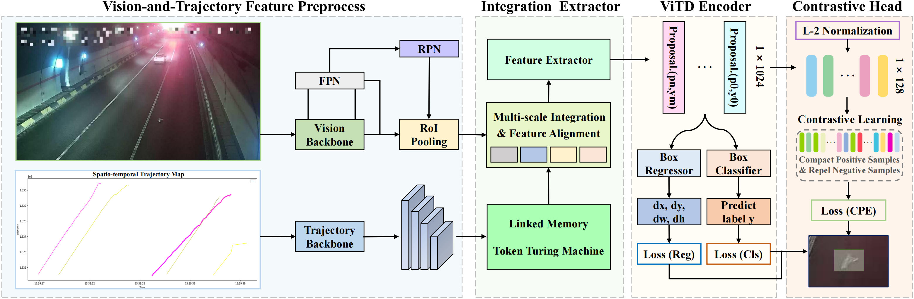
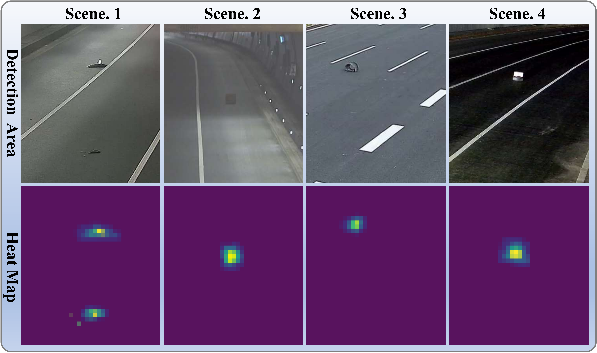

# Vision-and-Trajectory Detection (ViTD): A New Paradigm for Detecting Highway Abandoned Objects

<p align="center">
    
</p>

- [Vision-and-Trajectory Detection (ViTD): A New Paradigm for Detecting Highway Abandoned Objects](#vision-and-trajectory-detection-vitd-a-new-paradigm-for-detecting-highway-abandoned-objects)
  - [💬 Task: ViTD](#-task-vitd)
  - [🗃️ Dataset: ViTD-Highway](#️-dataset-vitd-highway)
  - [💡 Architecture: ViTD-FL](#-architecture-vitd-fl)
  - [🔍 Results](#-results)
  - [👁️ Visualization](#️-visualization)
  - [🏷️ Requirement](#️-requirement)
  - [📄 Preparation](#-preparation)

<p align="center">
    
</p>

## 💬 Task: ViTD

The ViTD task focuses on monocular image-based abandoned objects detection guided by vehicle trajectory analysis, fusing visual features and spatio-temporal trajectory information to enable more robust detection decisions in dynamic traffic scenarios. By jointly modeling visual and trajectory modalities, this task advances beyond conventional visual-centric detection approaches towards holistic traffic scene understanding required by ITS. To the best of our knowledge, we are the first to propose and implement vision-and-trajectory fusion for AOD, establishing a new paradigm that unifies static image perception with dynamic traffic scene understanding.

<div align="center">
  
</div>

## 🗃️ Dataset: ViTD-Highway
To facilitate research on this newly introduced task, we construct and release a dedicated dataset for highway abandoned objects detection, called ViTD-Highway. Sourced from real-world surveillance footage across multiple Chinese highways, the dataset comprises the final frames of 6,435 video sequences paired with spatio-temporal trajectory maps. These maps, generated via our custom trajectory rendering script and professionally calibrated, provide precise spatio-temporal context relevant to abandoned objects locations in the final video frames. 

Download our dataset. We build the first dataset for ViTD, termed ViTD-Highway, which can be downloaded from our [Web](https://www.baidu.com). The download link is available below:
```
https://drive.google.com
```

<div align="center">
  
</div>


## 💡 Architecture: ViTD-FL

<div align="center">
  
</div>
The Vision-and-Trajectory Feature Preprocessing extracts initial visual and trajectory features using dedicated backbones, FPN, RPN, and RoI Pooling. The Integration Extractor leverages a Linked Memory Token Turing Machine (LMTTM) and multi-scale alignment module to fuse the multi-modal features progressively. The ViTD Encoder performs standard detection tasks, including bounding box regression and object classification. A parallel Contrastive Head enhances feature discriminability by learning compact proposal embeddings through contrastive learning, optimized  with the Contrastive Proposal Encoding (CPE) loss.

## 🔍 Results

Comparison ViTD-FL with baselines on ViTD-Highway Dataset.
<div align="center">
  
</div>

## 👁️ Visualization

Visualizations from our ViTD-FL on our ViTD-Highway Dataset.

<div align="center">
  
</div>
In the figure, the red bounding boxes represent ground truth boxes,the green bounding boxes represent predicted boxes, and the yellow regions are zoomed-in views of Abandoned Objects.Scene 1 contains multiple Abandoned Objects, Scene 2 represents a low-visibility scenario, while Scene 3 and Scene 4 are normal scenes.

<div align="center">
  
</div>
 Feature heatmap corresponding to the Abandoned
Object image region.


## 🏷️ Requirement

| Name  |Version   |
| ------------ | ------------ |
|  Python | 3.8  |
|  CUDA | >=10.1  |
|  Pytorch | 1.12.1  |

The rest of the environment is installed with the following command
```shell
cd <project path>
pip install -r requirement.txt
```

## 📄 Preparation

Clone the repository
```shell
git clone <repository url>
```