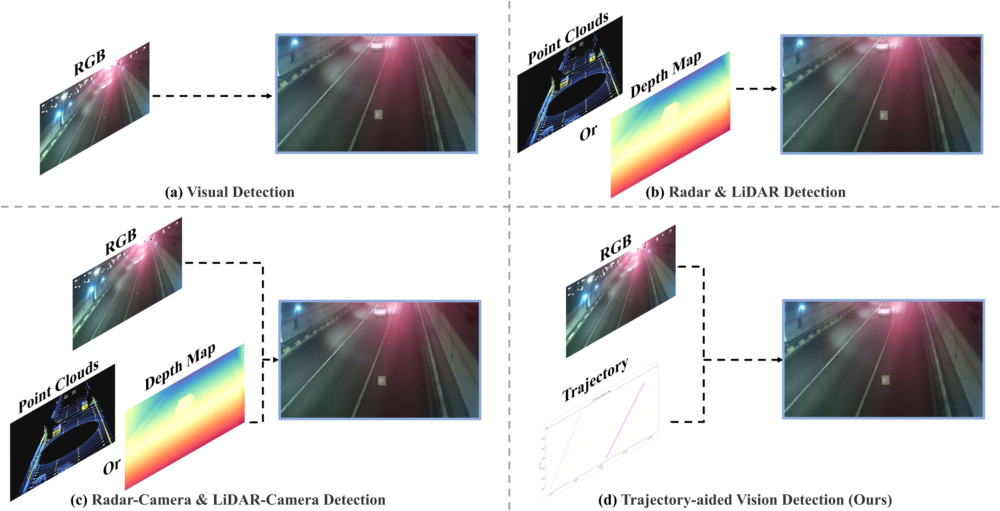
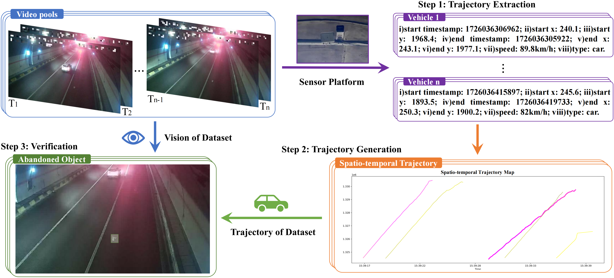
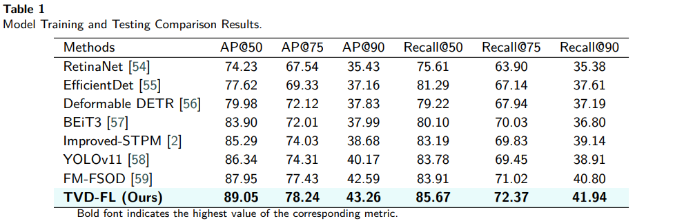

# Trajectory-aided Vision Detection (TVD): ): A Novel Approach for for Highway Abandoned Object Detection
 
 <p align="center">
     
 </p>
 
- [Trajectory-aided Vision Detection (TVD): A New Paradigm for Detecting Highway Abandoned Objects](#vision-and-trajectory-detection-TVD-a-new-paradigm-for-detecting-highway-abandoned-objects)
  - [💬 Task: TVD](#-task-TVD)
  - [🗃️ Dataset: TVD-Highway](#️-dataset-TVD-highway)
    - [Data Preparation](#data-preparation)
  - [💡 Architecture: TVD-FL](#-architecture-TVD-fl)
  - [🔍 Results](#-results)
  - [👁️ Visualization](#️-visualization)
  - [🏷️ Requirement](#️-requirement)
  - [📄 Preparation](#-preparation)
    - [Training and Evaluation](#training-and-evaluation)
    - [Contribution Guidelines](#contribution-guidelines)
  - [✨ Acknowledgments](#-acknowledgments)
 
 <p align="center">
     
 </p>
 
 ## 💬 Task: TVD
 
 The TVD task focuses on monocular image-based abandoned objects detection guided by vehicle trajectory analysis, fusing visual features and spatio-temporal trajectory information to enable more robust detection decisions in dynamic traffic scenarios. By jointly modeling visual and trajectory modalities, this task advances beyond conventional visual-centric detection approaches towards holistic traffic scene understanding required by ITS. To the best of our knowledge, we are the first to propose and implement vision-and-trajectory fusion for AOD, establishing a new paradigm that unifies static image perception with dynamic traffic scene understanding.
 
 <div align="center">
   
 </div>
 
 ## 🗃️ Dataset: TVD-Highway
 To facilitate research on this newly introduced task, we construct and release a dedicated dataset for highway abandoned objects detection, called TVD-Highway. Sourced from real-world surveillance footage across multiple Chinese highways, the dataset comprises the final frames of 6,435 video sequences paired with spatio-temporal trajectory maps. These maps, generated via our custom trajectory rendering script and professionally calibrated, provide precise spatio-temporal context relevant to abandoned objects locations in the final video frames. 
 
 Download our dataset. We build the first dataset for TVD, termed TVD-Highway, which can be downloaded from our [Web](https://1drv.ms/u/c/c251f33a7b0ec098/EcNmOlVLxN9JmdH2gKoHQDsBLv7R0EYx5SI37JFr18bFyg?e=W7VqpX). The download link is available below:
 ```
 https://1drv.ms/u/c/c251f33a7b0ec098/EcNmOlVLxN9JmdH2gKoHQDsBLv7R0EYx5SI37JFr18bFyg?e=W7VqpX
 ```
 
 <div align="center">
   
 </div>
 
 
### Data Preparation
Our dataset is organized in the COCO format. Ensure your dataset follows this structure:
```
coco
 ├── Final_Frame
 │   ├── XXXXX.jpg
 │   ├── XXXXX.jpg
 │   └── ...
 └── Trajectory
     ├── XXXXX.jpg
     ├── XXXXX.jpg
     └── ...
```

 ## 💡 Architecture: TVD-FL
 
 <div align="center">
   
 </div>
 The Vision-and-Trajectory Feature Preprocessing extracts initial visual and trajectory features using dedicated backbones, FPN, RPN, and RoI Pooling. The Integration Extractor leverages a Linked Memory Token Turing Machine (LMTTM) and multi-scale alignment module to fuse the multi-modal features progressively. The TVD Encoder performs standard detection tasks, including bounding box regression and object classification. A parallel Contrastive Head enhances feature discriminability by learning compact proposal embeddings through contrastive learning, optimized  with the Contrastive Proposal Encoding (CPE) loss.
 
 ## 🔍 Results
 
 Comparison TVD-FL with baselines on TVD-Highway Dataset.
 <div align="center">
   
 </div>
 
 ## 👁️ Visualization
 
 Visualizations from our TVD-FL on our TVD-Highway Dataset.
 
 <div align="center">
   
 </div>
 In the figure, the red bounding boxes represent ground truth boxes,the green bounding boxes represent predicted boxes, and the yellow regions are zoomed-in views of Abandoned Objects.Scene 1 contains multiple Abandoned Objects, Scene 2 represents a low-visibility scenario, while Scene 3 and Scene 4 are normal scenes.
 
 <div align="center">
   
 </div>
  Feature heatmap corresponding to the Abandoned
 Object image region.
 
 
 ## 🏷️ Requirement
 
 | Name  |Version   |
 | ------------ | ------------ |
 |  Python | 3.9  |
 |  CUDA | >=11.1  |
 |  Pytorch | 1.12.1  |
 
1. Install dependencies:
```bash
pip install -r requirements.txt
```
2. Build and install the project:
```bash
python setup.py build develop
```
 
 ## 📄 Preparation
 
 Clone the repository
 ```shell
 git clone <repository url>
 ```

### Training and Evaluation
1. Training Script
To start the training process, use the following command:
```bash
python tools/trainnet.py --num-gpus 8 --config-file <CONFIGPATH> --opts MODEL.WEIGHTS <WEIGHTSPATH>
```
Parameters:
- `--config-file`: Specify the path to the configuration file.
- `--opts`: Optional parameters to override settings in the configuration file. For example, specify the path to the model weights.
2. Testing Script
To perform testing and evaluation, use the following command:
```bash
python tools/testnet.py --num-gpus 8 --config-file <CONFIGPATH> --eval-only
```
Parameters:
- `--num-gpus`: Specify the number of GPUs to use.
- `--config-file`: Specify the path to the configuration file.
- `--eval-only`: Specify to only perform evaluation, not training.

### Contribution Guidelines
If you wish to contribute to this project, please follow these guidelines:
1. Fork the project to your GitHub account.
2. Create a new branch for development.
3. Submit a Pull Request and describe your changes.
   
## ✨ Acknowledgments
Thank all individuals and organizations that have contributed to this project.

